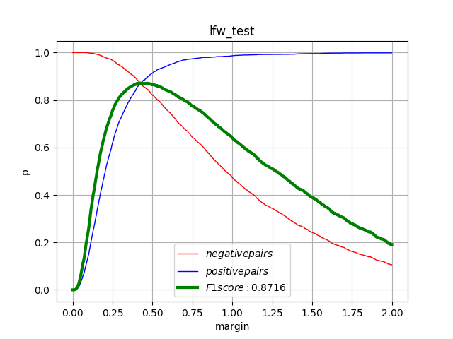

# Face_Recognition_Client
GUI version of Dlib library-based face recognition time and attendance system.

<table width="100%" border="0" cellspacing="0" cellpadding="0">
  <tr>
    <td align="center"> </td>
  </tr>
  <tr>
    <td align="center">Fig.1 LFW detection result graph.</td>
  </tr>

 
